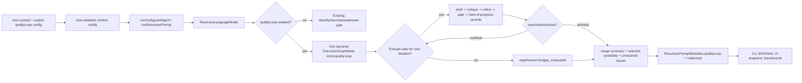

# Phase 12: Loop Runtime Contract - Research

**Researched:** 2026-05-16  
**Domain:** TypeScript recursive execution runtime, execution graph metadata, bounded loop state  
**Confidence:** HIGH

<user_constraints>
## User Constraints (from CONTEXT.md)

### Locked Decisions
## Implementation Decisions

### Runtime Shape and Graph Boundary
- Represent a quality loop as one top-level execution graph node, with internal phases living in loop metadata rather than expanding into top-level graph nodes.
- Store loop history in typed loop metadata on the graph node and final result metadata; use trace/events for lifecycle observability, not as the canonical state store.
- Keep Phase 12 focused on the bounded loop contract, node shape, stop reasons, budget accounting, and placeholder phase records; leave rubric scoring depth and best-of-progress selection algorithms to Phases 13 and 14.
- Require every completed, stopped, degraded, cancelled, or failed loop terminal state to include an explicit stop reason and usage summary. Missing terminal reason is a bug.

### Bounds, Budgets, and Stop Reasons
- Add an explicit loop config object with validated `maxIterations`, defaulting conservatively before a loop starts.
- Track loop-local model-call usage inside the global `maxModelCalls` budget and stop with `budget_exhausted` before starting an iteration that cannot finish the required loop phases.
- On degraded or stopped loops, return the best available candidate plus degraded/stopped metadata and unresolved issues unless no candidate exists.
- Include iteration count, phase call counts, token totals when available, model-call total, and stop reason in typed loop metadata and CLI/JSON metadata.

### Inspectable Internal Loop State
- Record draft, critique, refine, gate, and best-of-progress placeholders per iteration, even if later phases fill richer schemas.
- Store concise candidate summaries plus optional artifact refs for full text so graph metadata remains inspectable without bloating state.
- Represent unresolved issues as structured records with severity, id, text, and source phase so later rubric and UI work can render them directly.
- Emit lifecycle events for loop start, each phase completion, iteration stop/continue decisions, and terminal stop reason, while keeping canonical state in typed metadata.

### Compatibility and Failure Handling
- Preserve current CLI and recursive workflow behavior unless quality loops are explicitly configured or invoked; do not implicitly wrap ordinary prompts in a loop.
- In Phase 12, allow placeholder phase outputs but require typed terminal metadata; later structured parse failures become explicit degraded or failed states in Phase 13.
- Treat human stop and cancellation as terminal loop outcomes with explicit stop reason, partial usage summary, and no silent fallback.
- Add fake-model/domain tests for loop bounds, budget exhaustion, terminal stop reasons, metadata shape, and preservation of non-loop behavior.

### the agent's Discretion
The agent may choose exact TypeScript names, helper boundaries, and internal function layout as long as the public runtime contract is typed, explicit, backward-compatible, and aligned with existing domain/application/UI boundaries.

### Deferred Ideas (OUT OF SCOPE)
## Deferred Ideas

- Full adaptive rubric selection and structured evaluator schemas belong to Phase 13.
- Refine algorithm details and final best-of-progress selection logic belong to Phase 14.
- Phase-specific loop model override UX belongs to Phase 15.
- Rich UI/CLI loop inspection and human loop controls belong to Phase 16.
- Full cross-surface regression harness belongs to Phase 17.
</user_constraints>

<phase_requirements>
## Phase Requirements

| ID | Description | Research Support |
|----|-------------|------------------|
| LOOP-01 | User can run an answer-quality refinement loop as one collapsed top-level execution graph node with inspectable internal `draft -> critique -> refine -> gate -> best-of-progress` history. | Extend `ExecutionGraphNode` with typed `loop` metadata and keep per-phase history nested inside the loop node, not separate graph nodes. [VERIFIED: .planning/REQUIREMENTS.md] [VERIFIED: src/domain/types.ts] |
| LOOP-02 | User can configure hard loop bounds, including max iterations and model-call budget behavior, and every loop exits with an explicit stop reason. | Add validated `qualityLoop` config on `RecursiveModelConfig`, account loop calls through existing `modelCalls`/`remainingModelCalls()`, and make terminal stop reason required in loop metadata. [VERIFIED: .planning/REQUIREMENTS.md] [VERIFIED: src/domain/recursive-language-model.ts] |
| LOOP-03 | User can inspect loop history including candidate text summaries, critiques, refinements, scores, unresolved issues, selected candidate, phase model, and token/model-call usage. | Define typed `LoopIterationRecord`, `LoopPhaseRecord`, `LoopUsageSummary`, unresolved issue records, selected candidate refs, and phase model/usage fields in `src/domain/types.ts`. [VERIFIED: .planning/REQUIREMENTS.md] [VERIFIED: src/domain/types.ts] |
</phase_requirements>

## Summary

Phase 12 should extend the existing domain runtime contract instead of introducing a separate orchestration subsystem. `RecursiveLanguageModel` already owns model-call accounting, execution graph mutation, trace recording, cancellation checks, and terminal run status, so the quality loop contract belongs in `src/domain/recursive-language-model.ts` plus shared types in `src/domain/types.ts`. [VERIFIED: src/domain/recursive-language-model.ts] [VERIFIED: src/domain/types.ts]

The loop must be represented as one top-level execution graph node whose internal draft, critique, refine, gate, and best-of-progress history is stored in typed loop metadata on the node and final run metadata. Trace/events should mirror lifecycle changes but should not become the canonical state store. [VERIFIED: .planning/phases/12-loop-runtime-contract/12-CONTEXT.md]

**Primary recommendation:** Add a typed `QualityLoopMetadata` contract to `RecursivePromptMetadata` and `ExecutionGraphNode`, then implement an opt-in `runQualityLoop()` path in `RecursiveLanguageModel` that uses existing `complete()`, budget, cancellation, event, and graph update mechanisms. [VERIFIED: src/domain/recursive-language-model.ts] [ASSUMED]

## Project Constraints (from AGENTS.md)

- Preserve the repository architecture: orchestration in `src/application/`, recursion policy in `src/domain/`, CLI/I/O in `src/cli/`, ports in `src/ports/`, and adapters in `src/adapters/`. [VERIFIED: AGENTS.md]
- Extend new tools through `ToolPort`, `src/index.ts` registration, and YAML agent tool allowlisting; Phase 12 should not need new tools. [VERIFIED: AGENTS.md]
- Add new agents through YAML and `agent-registry.ts` only when a dedicated profile is needed; Phase 12 should not add a new agent profile. [VERIFIED: AGENTS.md]
- Add workflows under YAML `workflows` and ensure agent ids exist in the registry; Phase 12 should preserve existing workflow behavior unless a loop is explicitly configured. [VERIFIED: AGENTS.md] [VERIFIED: .planning/phases/12-loop-runtime-contract/12-CONTEXT.md]
- Use README for install, usage, and configuration field context when changing public CLI/config behavior. [VERIFIED: AGENTS.md]
- v1 priorities include approval checkpoint edit/add/delete, node-card model visibility and overrides, initial-plan-only approval override mode, and no silent failures; loop work must not regress these behaviors. [VERIFIED: AGENTS.md]

## Architectural Responsibility Map

| Capability | Primary Tier | Secondary Tier | Rationale |
|------------|-------------|----------------|-----------|
| Loop runtime state contract | API / Backend domain runtime | Browser / Client | `RecursiveLanguageModel` and `RecursivePromptMetadata` are the canonical runtime state producers; UI consumes `ExecutionGraphNode` snapshots. [VERIFIED: src/domain/recursive-language-model.ts] [VERIFIED: ui/src/main.tsx] |
| Collapsed graph node representation | API / Backend domain runtime | Browser / Client | Execution graph nodes are created and updated in domain runtime and mirrored through `ExecutionControl`; React Flow renders snapshots. [VERIFIED: src/domain/recursive-language-model.ts] [VERIFIED: src/application/execution-controller.ts] [VERIFIED: ui/src/main.tsx] |
| Max iteration and model-call budget enforcement | API / Backend domain runtime | CLI/config loader | Runtime config is validated in `project-config.ts`, but spending and remaining calls are enforced inside `RecursiveLanguageModel`. [VERIFIED: src/application/project-config.ts] [VERIFIED: src/domain/recursive-language-model.ts] |
| Terminal stop reasons and usage summary | API / Backend domain runtime | CLI/JSON renderer | Runtime metadata should carry stop reason and usage summary; CLI text/JSON should only render the canonical metadata. [VERIFIED: src/domain/types.ts] [VERIFIED: src/cli/render.ts] |
| Loop inspection in UI | Browser / Client | API / Backend control session | Phase 12 should supply typed metadata; rich rendering is deferred to Phase 16, but current node inspector can display extra fields once added to the UI type. [VERIFIED: ui/src/main.tsx] [VERIFIED: .planning/ROADMAP.md] |

## Standard Stack

### Core

| Library | Version | Purpose | Why Standard |
|---------|---------|---------|--------------|
| TypeScript | 6.0.3, modified 2026-04-16 | Static typing for the loop runtime contract and discriminated unions. | Existing repo is TypeScript with strict settings, `exactOptionalPropertyTypes`, and `noUncheckedIndexedAccess`. [VERIFIED: npm registry] [VERIFIED: tsconfig.json] |
| Zod | 4.4.3, modified 2026-05-04 | Validate YAML loop config and future structured evaluator outputs. | Existing config loader already validates project config with Zod; Context7 documents `parse` and `safeParse` APIs for schema parsing. [VERIFIED: npm registry] [VERIFIED: src/application/project-config.ts] [CITED: https://zod.dev/v4] |
| Node.js test runner | Node v22.20.0 local runtime | Fake-model domain tests and CLI/render regression tests. | Existing test suite uses `node:test` and `node:assert/strict`; Context7 Node v22.20.0 docs cover async tests and subtests. [VERIFIED: local command] [VERIFIED: tests/recursive-language-model.test.ts] [CITED: https://github.com/nodejs/node/blob/v22.20.0/doc/api/test.md] |

### Supporting

| Library | Version | Purpose | When to Use |
|---------|---------|---------|-------------|
| `@types/node` | 25.8.0, modified 2026-05-14 | Node type definitions for the current TS compile. | Keep existing dev dependency; do not add a second test framework for Phase 12. [VERIFIED: npm registry] [VERIFIED: package.json] |
| `tsx` | 4.22.1, modified 2026-05-17 | Dev-time TypeScript execution. | Existing `npm run dev` uses `tsx`; Phase 12 should not require runtime build changes. [VERIFIED: npm registry] [VERIFIED: package.json] |

### Alternatives Considered

| Instead of | Could Use | Tradeoff |
|------------|-----------|----------|
| Extend `RecursivePromptMetadata` and `ExecutionGraphNode` | Store loop history only in trace events | Rejected because Phase 12 decisions require typed loop metadata as canonical state and trace/events only for observability. [VERIFIED: .planning/phases/12-loop-runtime-contract/12-CONTEXT.md] |
| Existing Node test runner | Vitest/Jest | Rejected because current tests already use `node:test`, and adding a framework is unnecessary for fake-model runtime tests. [VERIFIED: tests/recursive-language-model.test.ts] [VERIFIED: package.json] |
| Zod config validation | Hand-written config checks | Rejected because `project-config.ts` already standardizes Zod validation. [VERIFIED: src/application/project-config.ts] |

**Installation:**
```bash
npm install
```

No new runtime package is required for Phase 12. [VERIFIED: package.json]

**Version verification:**
```bash
npm view typescript version time.modified dist-tags.latest
npm view zod version time.modified dist-tags.latest
npm view @types/node version time.modified dist-tags.latest
npm view tsx version time.modified dist-tags.latest
```

## Architecture Patterns

### System Architecture Diagram



Diagram reflects the locked single-node boundary and canonical metadata requirement. [VERIFIED: .planning/phases/12-loop-runtime-contract/12-CONTEXT.md]

### Recommended Project Structure

```text
src/
├── domain/
│   ├── types.ts                       # Loop config, metadata, stop reasons, usage summaries
│   └── recursive-language-model.ts    # Opt-in quality loop runtime path and graph updates
├── application/
│   └── project-config.ts              # Zod validation/defaults for runtime.qualityLoop
├── cli/
│   ├── args.ts                        # Optional loop CLI flags if Phase 12 exposes CLI config
│   └── render.ts                      # Compact/JSON loop metadata pass-through
└── ports/
    └── language-model-port.ts         # Add loop phase purposes only if model routing needs typed purposes now
```

This structure follows the repository boundaries in AGENTS.md and existing runtime ownership. [VERIFIED: AGENTS.md] [VERIFIED: src/domain/recursive-language-model.ts] [VERIFIED: src/application/project-config.ts]

### Pattern 1: Typed Loop Metadata on Existing Contracts

**What:** Add discriminated, serializable loop types to `src/domain/types.ts`, then reference them from `ExecutionGraphNode` and `RecursivePromptMetadata`. [VERIFIED: src/domain/types.ts]  
**When to use:** Use for all loop canonical state that UI/CLI/JSON/tests must inspect. [VERIFIED: .planning/phases/12-loop-runtime-contract/12-CONTEXT.md]  
**Example:**
```typescript
// Source: project contract pattern in src/domain/types.ts; schema validation APIs from https://zod.dev/v4
export type QualityLoopStopReason =
  | "passed"
  | "critique_resolved"
  | "no_meaningful_improvement"
  | "max_iterations"
  | "budget_exhausted"
  | "human_accepted"
  | "stopped"
  | "degraded"
  | "failed";

export interface QualityLoopMetadata {
  config: QualityLoopConfig;
  status: "running" | "completed" | "stopped" | "degraded" | "failed" | "cancelled";
  stopReason?: QualityLoopStopReason;
  usage: QualityLoopUsageSummary;
  iterations: QualityLoopIterationRecord[];
  selectedCandidateId?: string;
  unresolvedIssues: QualityLoopIssue[];
}
```

### Pattern 2: Budget Preflight Before Iteration

**What:** Before starting an iteration, compare `remainingModelCalls()` against the number of required loop phase calls and stop with `budget_exhausted` before partially starting an iteration that cannot finish. [VERIFIED: .planning/phases/12-loop-runtime-contract/12-CONTEXT.md] [VERIFIED: src/domain/recursive-language-model.ts]  
**When to use:** Every quality loop iteration, including placeholder Phase 12 phases. [VERIFIED: .planning/phases/12-loop-runtime-contract/12-CONTEXT.md]  
**Example:**
```typescript
// Source: existing canSpendAnyModelCall()/remainingModelCalls() pattern in src/domain/recursive-language-model.ts
const requiredCalls = requiredLoopCallsPerIteration(loopConfig);
if (this.remainingModelCalls() < requiredCalls) {
  return this.finishLoop(loopNode, {
    status: "stopped",
    stopReason: "budget_exhausted",
    message: "Model-call budget cannot complete another loop iteration.",
  });
}
```

### Pattern 3: Events Mirror Metadata, Not Replace It

**What:** Emit execution events for loop lifecycle transitions while writing canonical loop state to `node.loop` and `metadata.qualityLoop`. [VERIFIED: .planning/phases/12-loop-runtime-contract/12-CONTEXT.md]  
**When to use:** Start, phase completion, continue/stop decision, degraded/failed/cancelled terminal state. [VERIFIED: .planning/phases/12-loop-runtime-contract/12-CONTEXT.md]  
**Example:**
```typescript
// Source: existing emitExecution(event) shape in src/domain/recursive-language-model.ts
this.emitExecution({
  type: "execution",
  status: "running",
  nodeId: loopNode.id,
  modelCallsUsed: this.modelCalls,
  modelCallsRemaining: this.remainingModelCalls(),
  toolCallsUsed: this.metadata.toolCalls.length,
  message: `quality loop phase completed: ${phase}`,
});
```

### Anti-Patterns to Avoid

- **Top-level node fanout for loop internals:** This violates the Phase 12 graph boundary; nested loop metadata is required. [VERIFIED: .planning/phases/12-loop-runtime-contract/12-CONTEXT.md]
- **Terminal metadata with optional/absent stop reason:** Missing terminal reason is explicitly a bug. [VERIFIED: .planning/phases/12-loop-runtime-contract/12-CONTEXT.md]
- **Loop-only shadow budget counter:** Loop usage must be local for reporting but still spend from global `maxModelCalls`. [VERIFIED: .planning/phases/12-loop-runtime-contract/12-CONTEXT.md] [VERIFIED: src/domain/recursive-language-model.ts]
- **Implicit loop wrapping of all prompts:** Existing CLI and recursive workflow behavior must remain unchanged unless loops are explicitly configured or invoked. [VERIFIED: .planning/phases/12-loop-runtime-contract/12-CONTEXT.md]

## Don't Hand-Roll

| Problem | Don't Build | Use Instead | Why |
|---------|-------------|-------------|-----|
| Runtime config validation | Manual nested `typeof` checks | Existing Zod config schema | Project already validates config through Zod, and Zod documents parse/safeParse schema APIs. [VERIFIED: src/application/project-config.ts] [CITED: https://zod.dev/v4] |
| Test harness | Custom fake test runner | Existing `node:test` + `node:assert/strict` | Current suite already uses Node test runner; Node docs support async tests/subtests. [VERIFIED: tests/recursive-language-model.test.ts] [CITED: https://github.com/nodejs/node/blob/v22.20.0/doc/api/test.md] |
| Event/state bus | Separate loop event store | Existing `ExecutionEvent`, `ExecutionControl`, and `RecursivePromptMetadata` | Runtime already emits execution events and maintains metadata/graph state. [VERIFIED: src/domain/types.ts] [VERIFIED: src/domain/recursive-language-model.ts] |
| Model-call accounting | Independent loop counter only | Existing `modelCalls`, `remainingModelCalls()`, `recordUsage()` | Global budget and token usage are already centralized in the engine. [VERIFIED: src/domain/recursive-language-model.ts] |

**Key insight:** The expensive bugs in this phase come from split authority: if trace, UI state, CLI metadata, and loop runtime each invent their own loop state, stop reasons and budgets will drift. [VERIFIED: .planning/phases/12-loop-runtime-contract/12-CONTEXT.md] [VERIFIED: src/domain/recursive-language-model.ts]

## Common Pitfalls

### Pitfall 1: Expanding Loop Phases as Graph Nodes

**What goes wrong:** The graph shows draft, critique, refine, gate, and best-of-progress as top-level nodes instead of one collapsed quality-loop node. [VERIFIED: .planning/REQUIREMENTS.md]  
**Why it happens:** Existing recursion represents child tasks as child graph nodes, so reusing that path directly would fan out the loop. [VERIFIED: src/domain/recursive-language-model.ts]  
**How to avoid:** Create a loop node with a new node kind or loop metadata flag, then store internal phase records inside `node.loop.iterations`. [VERIFIED: src/domain/types.ts] [ASSUMED]  
**Warning signs:** `executionGraph.edges` gains loop phase edges or UI sees five sibling nodes per iteration. [VERIFIED: src/domain/types.ts] [VERIFIED: ui/src/main.tsx]

### Pitfall 2: Budget Exhaustion After Partial Iteration

**What goes wrong:** The loop starts critique/refine/gate work it cannot finish, then returns unclear partial state. [VERIFIED: .planning/phases/12-loop-runtime-contract/12-CONTEXT.md]  
**Why it happens:** Existing direct recursion can fallback when calls are nearly exhausted; loop requirements instead require preflight before starting an iteration. [VERIFIED: src/domain/recursive-language-model.ts] [VERIFIED: .planning/phases/12-loop-runtime-contract/12-CONTEXT.md]  
**How to avoid:** Reserve/preflight the full required phase-call count before each iteration. [VERIFIED: .planning/phases/12-loop-runtime-contract/12-CONTEXT.md]  
**Warning signs:** `stopReason=budget_exhausted` appears after a partial phase record with no selected candidate or usage summary. [VERIFIED: .planning/phases/12-loop-runtime-contract/12-CONTEXT.md]

### Pitfall 3: Optional Terminal Stop Reason

**What goes wrong:** A loop reaches `completed`, `stopped`, `degraded`, `cancelled`, or `failed` without a reason users can inspect. [VERIFIED: .planning/phases/12-loop-runtime-contract/12-CONTEXT.md]  
**Why it happens:** TypeScript optional fields make it easy to represent in-progress and terminal states with the same shape. [VERIFIED: tsconfig.json]  
**How to avoid:** Use discriminated terminal metadata or a helper that refuses to finish without `stopReason` and usage summary. [ASSUMED]  
**Warning signs:** Tests only assert status, not stop reason and usage summary. [VERIFIED: tests/recursive-language-model.test.ts]

### Pitfall 4: Phase 12 Overreaches Into Rubrics and Selection Algorithms

**What goes wrong:** Implementation grows into structured evaluator parsing, adaptive rubric selection, or best-of-progress scoring. [VERIFIED: .planning/ROADMAP.md]  
**Why it happens:** LOOP-03 names scores and selection data, but Phase 13 and Phase 14 own rich evaluator and selection behavior. [VERIFIED: .planning/ROADMAP.md] [VERIFIED: .planning/REQUIREMENTS.md]  
**How to avoid:** Store placeholder scores, candidate refs, and selected-candidate fields now; leave semantics simple and explicitly typed. [VERIFIED: .planning/phases/12-loop-runtime-contract/12-CONTEXT.md]  
**Warning signs:** New rubric ids, evaluator schemas, or phase-specific routing appear in Phase 12 tasks. [VERIFIED: .planning/ROADMAP.md]

## Code Examples

Verified patterns from project and official sources:

### Zod Config Extension

```typescript
// Source: src/application/project-config.ts and https://zod.dev/v4
const qualityLoopSchema = z.object({
  enabled: z.boolean().default(false),
  maxIterations: z.number().int().positive().default(3),
  budgetBehavior: z.enum(["stop_before_partial_iteration"]).default("stop_before_partial_iteration"),
}).default({
  enabled: false,
  maxIterations: 3,
  budgetBehavior: "stop_before_partial_iteration",
});
```

### Fake-Model Usage Assertions

```typescript
// Source: tests/recursive-language-model.test.ts and Node test runner docs
test("quality loop stops before partial iteration when budget cannot finish", async () => {
  const trace = new InMemoryTrace();
  const engine = new RecursiveLanguageModel(new QueueModel(["draft", "critique"]), trace);
  const result = await engine.run({
    prompt: "Improve this answer",
    config: {
      ...config,
      maxDepth: 0,
      maxModelCalls: 2,
      qualityLoop: { enabled: true, maxIterations: 2, budgetBehavior: "stop_before_partial_iteration" },
    },
  });

  assert.equal(result.metadata.qualityLoop?.stopReason, "budget_exhausted");
  assert.equal(result.metadata.qualityLoop?.usage.modelCallsTotal, result.metadata.modelCalls);
});
```

### Canonical Metadata With Event Mirroring

```typescript
// Source: src/domain/recursive-language-model.ts
node.loop = nextLoopMetadata;
this.metadata.qualityLoop = nextLoopMetadata;
this.updateExecutionGraph();
this.emitExecution({
  type: "execution",
  status: node.status,
  nodeId: node.id,
  modelCallsUsed: this.modelCalls,
  modelCallsRemaining: this.remainingModelCalls(),
  toolCallsUsed: this.metadata.toolCalls.length,
  message: `quality loop stopped: ${nextLoopMetadata.stopReason}`,
});
```

## State of the Art

| Old Approach | Current Approach | When Changed | Impact |
|--------------|------------------|--------------|--------|
| Unstructured runtime metadata or trace-only inspection | Typed metadata plus graph snapshots and execution events | Existing v1.1 codebase before Phase 12 | Phase 12 should extend typed contracts instead of parsing trace strings. [VERIFIED: src/domain/types.ts] [VERIFIED: src/domain/recursive-language-model.ts] |
| Generic failed/completed status only | Explicit failure categories, executionStatus, run summaries, and non-silent failures | Existing v1.1 codebase before Phase 12 | Loop terminal states should include stop reason and usage summary, not only node status. [VERIFIED: src/domain/execution-failure.ts] [VERIFIED: src/cli/render.ts] [VERIFIED: AGENTS.md] |
| Project tests through external runner | Built-in Node test runner over compiled `dist/tests/*.test.js` | Existing package scripts | Planner should add focused Node tests, then run `npm test` and `npm run build`. [VERIFIED: package.json] [VERIFIED: local command] |

**Deprecated/outdated:**
- Trace-only loop state is out of scope for canonical state because CONTEXT.md explicitly assigns canonical loop history to typed metadata. [VERIFIED: .planning/phases/12-loop-runtime-contract/12-CONTEXT.md]
- Adding a new test framework is unnecessary for Phase 12 because `node:test` already covers async fake-model tests and the repo already uses it. [VERIFIED: tests/recursive-language-model.test.ts] [CITED: https://github.com/nodejs/node/blob/v22.20.0/doc/api/test.md]

## Assumptions Log

| # | Claim | Section | Risk if Wrong |
|---|-------|---------|---------------|
| A1 | `runQualityLoop()` is the right internal helper boundary inside `RecursiveLanguageModel`. | Summary / Architecture Patterns | Planner may choose a different helper layout, but behavior and public contract remain valid. |
| A2 | Default `maxIterations` should be `3` as a conservative starting point. | Code Examples | User may prefer a different default; expose it as config and test the actual chosen default. |
| A3 | A discriminated terminal metadata helper is the cleanest way to prevent missing stop reasons. | Common Pitfalls | Planner may instead use runtime assertions; tests must still prove terminal reason is present. |
| A4 | A loop node should likely use a new node kind or loop metadata flag. | Common Pitfalls | UI/API type updates differ depending on chosen representation; the single-node behavior remains required. |

## Resolved Planning Decisions

1. **Explicit loop invocation surface**
   - Decision: Phase 12 should support both YAML runtime config and CLI opt-in flags.
   - Exact contract: `runtime.qualityLoop.enabled`, `runtime.qualityLoop.maxIterations`, and `runtime.qualityLoop.budgetBehavior` in config; `--quality-loop` and `--quality-loop-max-iterations N` in CLI args.
   - Reason: Ordinary prompts must not be implicitly wrapped in a loop, but users need an executable Phase 12 entry point to verify the runtime contract. [VERIFIED: .planning/phases/12-loop-runtime-contract/12-CONTEXT.md] [VERIFIED: .planning/phases/12-loop-runtime-contract/12-01-PLAN.md]

2. **Loop phase model purposes**
   - Decision: Do not extend `LanguageModelPurpose` in Phase 12.
   - Exact contract: Loop phases use existing `"answer"` completion purpose and capture effective model snapshots in phase metadata. Dedicated draft/critique/refine/gate/best-of-progress routing is deferred to Phase 15.
   - Reason: Current purposes are `depth`, `classify`, `decompose`, `answer`, `summarize`, and `synthesize`; changing purpose routing now would pull Phase 15 scope into Phase 12. [VERIFIED: src/ports/language-model-port.ts] [VERIFIED: .planning/ROADMAP.md]

3. **Candidate text in graph metadata**
   - Decision: Store concise candidate summaries/previews capped at 160 characters plus optional `artifactRef`; do not build a new artifact store in Phase 12.
   - Exact contract: Runtime candidate records should use `summary: preview(output, 160)` or an equivalent 160-character cap, with full text left to future artifact persistence if needed.
   - Reason: CONTEXT.md requires inspectable graph metadata without bloating state. [VERIFIED: .planning/phases/12-loop-runtime-contract/12-CONTEXT.md] [VERIFIED: .planning/phases/12-loop-runtime-contract/12-02-PLAN.md]

## Environment Availability

| Dependency | Required By | Available | Version | Fallback |
|------------|-------------|-----------|---------|----------|
| Node.js | Build and tests | ✓ | v22.20.0 | None needed. [VERIFIED: local command] |
| npm | Package scripts and registry version checks | ✓ | 11.13.0 | None needed. [VERIFIED: local command] |
| TypeScript compiler | `npm run build`, `npm run typecheck` | ✓ | 6.0.3 | None needed. [VERIFIED: local command] |
| Node test runner | `npm test` | ✓ | bundled with Node v22.20.0 | None needed. [VERIFIED: local command] |

**Missing dependencies with no fallback:**
- None found. [VERIFIED: local command]

**Missing dependencies with fallback:**
- None found. [VERIFIED: local command]

## Validation Architecture

### Test Framework

| Property | Value |
|----------|-------|
| Framework | Node.js built-in test runner on Node v22.20.0. [VERIFIED: local command] [CITED: https://github.com/nodejs/node/blob/v22.20.0/doc/api/test.md] |
| Config file | none; package scripts compile with `tsc -p tsconfig.json` and run `node --test dist/tests/*.test.js`. [VERIFIED: package.json] |
| Quick run command | `npm run build && node --test dist/tests/recursive-language-model.test.js` [VERIFIED: package.json] |
| Full suite command | `npm test` [VERIFIED: package.json] |

### Phase Requirements -> Test Map

| Req ID | Behavior | Test Type | Automated Command | File Exists? |
|--------|----------|-----------|-------------------|--------------|
| LOOP-01 | Loop appears as one execution graph node with nested iteration history and no loop phase top-level nodes. | unit/integration | `npm run build && node --test dist/tests/recursive-language-model.test.js --test-name-pattern='quality loop graph node'` | ❌ Wave 0 |
| LOOP-02 | `maxIterations` is validated, budget preflight stops with `budget_exhausted`, and every terminal state has stop reason. | unit/integration | `npm run build && node --test dist/tests/recursive-language-model.test.js --test-name-pattern='quality loop budget'` | ❌ Wave 0 |
| LOOP-03 | Loop metadata includes candidate summaries, critiques/refinements/gate placeholders, selected candidate, phase model, tokens, model calls, and unresolved issues. | unit/integration | `npm run build && node --test dist/tests/recursive-language-model.test.js --test-name-pattern='quality loop metadata'` | ❌ Wave 0 |

### Sampling Rate

- **Per task commit:** `npm run build && node --test dist/tests/recursive-language-model.test.js` [VERIFIED: package.json]
- **Per wave merge:** `npm test` [VERIFIED: package.json]
- **Phase gate:** `npm run check` plus targeted review that ordinary non-loop behavior remains unchanged. [VERIFIED: package.json] [VERIFIED: .planning/phases/12-loop-runtime-contract/12-CONTEXT.md]

### Wave 0 Gaps

- [ ] `tests/recursive-language-model.test.ts` — add LOOP-01 collapsed node and metadata shape tests. [VERIFIED: tests/recursive-language-model.test.ts]
- [ ] `tests/recursive-language-model.test.ts` — add LOOP-02 max-iteration, budget-exhaustion, cancellation/stop-reason tests. [VERIFIED: tests/recursive-language-model.test.ts]
- [ ] `tests/recursive-language-model.test.ts` — add LOOP-03 phase usage/token/model/candidate metadata tests. [VERIFIED: tests/recursive-language-model.test.ts]
- [ ] Optional CLI/render test in `tests/recursive-language-model.test.ts` if Phase 12 updates compact/JSON loop output. [VERIFIED: tests/recursive-language-model.test.ts] [VERIFIED: src/cli/render.ts]

## Security Domain

### Applicable ASVS Categories

| ASVS Category | Applies | Standard Control |
|---------------|---------|------------------|
| V2 Authentication | no | No user authentication surface is added in Phase 12. [VERIFIED: .planning/ROADMAP.md] |
| V3 Session Management | no | Existing UI session/cancellation state remains local control-session state. [VERIFIED: src/application/execution-controller.ts] |
| V4 Access Control | partial | Preserve existing run-state capability token checks if loop state is persisted to run-state. [VERIFIED: src/domain/run-state-persistence.ts] [VERIFIED: src/ports/run-state-store-port.ts] |
| V5 Input Validation | yes | Validate new loop config with Zod and reject invalid bounds before runtime. [VERIFIED: src/application/project-config.ts] [CITED: https://zod.dev/v4] |
| V6 Cryptography | no | Phase 12 does not add cryptographic operations. [VERIFIED: .planning/ROADMAP.md] |

### Known Threat Patterns for TypeScript Local Runtime

| Pattern | STRIDE | Standard Mitigation |
|---------|--------|---------------------|
| Config injection through invalid loop bounds | Tampering | Zod schema with positive integer bounds and conservative defaults. [VERIFIED: src/application/project-config.ts] [CITED: https://zod.dev/v4] |
| Denial of service through unbounded iterations | Denial of Service | Required `maxIterations` plus global `maxModelCalls` preflight. [VERIFIED: .planning/phases/12-loop-runtime-contract/12-CONTEXT.md] [VERIFIED: src/domain/recursive-language-model.ts] |
| Silent failure or ambiguous terminal state | Repudiation | Required stop reason, usage summary, metadata tests, and non-zero failure behavior for failed runs. [VERIFIED: .planning/phases/12-loop-runtime-contract/12-CONTEXT.md] [VERIFIED: src/cli/render.ts] |
| Oversized graph metadata from full candidate text | Denial of Service | Store concise summaries/previews and optional artifact refs, not unlimited full text in graph state. [VERIFIED: .planning/phases/12-loop-runtime-contract/12-CONTEXT.md] |

## Sources

### Primary (HIGH confidence)

- `.planning/phases/12-loop-runtime-contract/12-CONTEXT.md` - locked Phase 12 decisions, boundaries, stop reasons, deferred scope. [VERIFIED: codebase read]
- `.planning/REQUIREMENTS.md` - LOOP-01, LOOP-02, LOOP-03 requirement text and phase mapping. [VERIFIED: codebase read]
- `.planning/ROADMAP.md` - Phase 12-17 sequence and deferred rubric/refine/routing/UI/regression scope. [VERIFIED: codebase read]
- `AGENTS.md` - repository boundaries and extension rules. [VERIFIED: codebase read]
- `src/domain/types.ts` - current metadata, graph, execution event, budget, run-state types. [VERIFIED: codebase read]
- `src/domain/recursive-language-model.ts` - current runtime ownership of recursion, graph updates, model calls, tokens, events, cancellation, and failures. [VERIFIED: codebase read]
- `src/application/project-config.ts` - Zod-backed runtime config validation/defaults. [VERIFIED: codebase read]
- `tests/recursive-language-model.test.ts` - existing fake-model test patterns. [VERIFIED: codebase read]
- npm registry checks for TypeScript, Zod, `@types/node`, and `tsx`. [VERIFIED: npm registry]
- Context7 `/websites/zod_dev_v4` docs for Zod parse/safeParse. [CITED: https://zod.dev/v4]
- Context7 `/nodejs/node/v22_20_0` docs for Node test runner. [CITED: https://github.com/nodejs/node/blob/v22.20.0/doc/api/test.md]

### Secondary (MEDIUM confidence)

- Local command `npm test` on 2026-05-16 passed 98 tests after building with TypeScript. [VERIFIED: local command]
- Local environment command reported Node v22.20.0, npm 11.13.0, and TypeScript 6.0.3. [VERIFIED: local command]

### Tertiary (LOW confidence)

- No tertiary web-only findings were used. [VERIFIED: research log]

## Metadata

**Confidence breakdown:**
- Standard stack: HIGH - package versions were checked against npm registry and existing repo scripts. [VERIFIED: npm registry] [VERIFIED: package.json]
- Architecture: HIGH - ownership is explicit in AGENTS.md and current domain/application/UI code. [VERIFIED: AGENTS.md] [VERIFIED: src/domain/recursive-language-model.ts] [VERIFIED: src/application/execution-controller.ts] [VERIFIED: ui/src/main.tsx]
- Pitfalls: HIGH - most pitfalls derive directly from locked Phase 12 decisions and current code paths. [VERIFIED: .planning/phases/12-loop-runtime-contract/12-CONTEXT.md] [VERIFIED: src/domain/recursive-language-model.ts]

**Research date:** 2026-05-16  
**Valid until:** 2026-06-15
