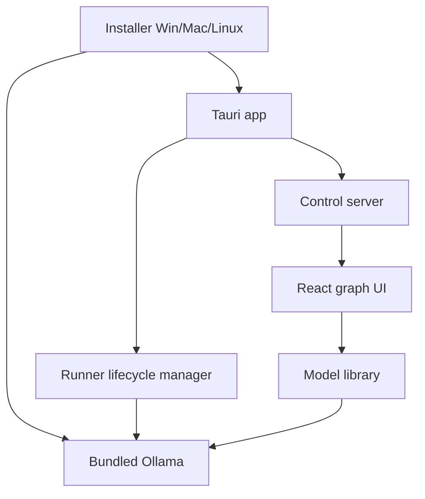

# Desktop Product Vision (Explore D)

**Date:** 2026-05-20  
**Context:** `$gsd-explore` — productize RLM as an installable desktop app with model library, multi-runner adapters, and sampling controls in the UI.  
**Proposed milestone:** v1.3 Desktop Product (Phases 21–23)

## Product intent

RLM should be **downloadable, installable, and runnable** without CLI or YAML setup. A somewhat tech-savvy user installs the app, launches a native window, downloads models from a built-in library (curated recommendations + Hugging Face search), tunes sampling parameters when they want to, and runs workflow graphs — without needing to know GGUF, quant levels, or how to start a local inference server manually.

Runner names (**Ollama**, **llama.cpp**, etc.) may appear in settings and advanced panels; the default path hides complexity.

## Target persona

| Trait | Detail |
|--------|--------|
| Technical level | Comfortable with software install; may recognize Ollama/llama.cpp by name |
| Expectation | Installer → icon → UI → download models → run |
| Not expected | Manual `ollama pull`, editing `rlm.config.yaml`, choosing quant formats |
| Power use | Temperature, top-p, max tokens via UI cascade (global → model → node) |

## Distribution & shell

- **Platforms:** Windows, macOS, Linux (v1).
- **Shell:** **Tauri** — embedded webview loading the existing React UI + control server; tray/quit lifecycle; not browser-only.
- **Installer:** Per-OS installer bundles RLM + **Ollama v1 default runner**; detects existing Ollama and skips duplicate install when compatible.
- **Launch:** App starts control server, ensures Ollama is listening (spawn bundled or detected instance), opens webview to session UI.

## Runner strategy

| Layer | v1 | Later |
|--------|-----|--------|
| **Bundled** | Ollama only | Optional llama.cpp add-on |
| **Adapters** | Ollama (existing), HTTP (existing) | llama.cpp, vLLM, cloud OpenAI-compatible |
| **Selection** | All curated models target bundled Ollama; HF results filtered to Ollama-compatible pull/import | Multi-runner routing per model metadata |

**Do not bundle Ollama + llama.cpp in v1.** Two managed runners doubles install size, startup logic, and catalog complexity. Keep `LanguageModelPort` + `hosts` as the extension point; see seed `.planning/seeds/multi-runner-adapters.md`.

Existing code alignment:

- `LanguageModelPort` — adapter boundary (keep)
- `OllamaLanguageModelAdapter` — v1 primary (keep, extend for runtime sampling)
- `HttpLanguageModelAdapter` — remote OpenAI-compatible endpoints (keep)
- `PurposeRoutingLanguageModel` + `hosts` in `project-config.ts` — extend with runner registry and sampling merge

## Model library

Two tiers in one UI surface:

### Curated catalog

- Shipped static list (10–20 entries initially): friendly name, use-case tags (Fast / Balanced / Best quality / Coding / Planning), RAM hint, underlying Ollama model id.
- One-click download with progress; “Ready” state when pull completes.
- Test matrix: verify curated entries on Win/Mac/Linux before release.

### Hugging Face search

- Search HF from UI (HF Hub API).
- Filter results to formats/runtimes v1 supports (Ollama-pullable or importable).
- Show compatibility warnings before download; explicit “unsupported” for models that cannot run on bundled runner.
- Download delegates to Ollama pull/import API with progress events surfaced in UI.

User selects **several models** into a local library; tiers and node overrides reference installed models by id.

## Sampling controls (cascade)

Resolve effective parameters at completion time:

1. **Global defaults** — app settings (temperature, top-p, top-k, repeat penalty, max tokens, seed where supported).
2. **Per-model profile** — each installed model may override globals; stored with model library entry.
3. **Per-node override** — node inspector (extends existing model override); highest precedence.

Trace and node metadata show which layer supplied each value. Adapters receive merged `LanguageModelCompleteOptions` (extend port as needed).

## Relationship to other proposed work

| Work | Relationship |
|------|----------------|
| Phase 18–20 (plan-from-node, export, expert team) | Orthogonal UX/features; can ship before or after desktop product depending on milestone priority |
| Phase 18 scope-out | Explicitly deferred HF installer and temperature UI to this milestone |
| Release hardening (signed artifacts) | Overlaps Phase 23 installer; coordinate signing/notarization there |

## Phasing (proposed)

| Phase | Focus |
|-------|--------|
| **21** | Runner registry refactor, sampling schema, cascade merge in `PurposeRoutingLanguageModel` / adapters |
| **22** | Model library API + UI (curated + HF search), Ollama pull progress, per-model profiles |
| **23** | Tauri shell, cross-platform installers, bundled Ollama lifecycle, first-run onboarding |

## Open spikes (before plan-phase)

- Tauri spawning Node control server + Ollama child processes (clean start/stop on all OSes).
- HF search → Ollama model resolution rules (which repos/formats are pullable).
- Installer tooling choice per platform (NSIS/WiX, dmg+notarize, deb/AppImage).
- RAM/VRAM preflight for curated entries (“may not fit this machine”).

## Success criteria (milestone)

- Fresh install on each OS: launch app → see curated models → download one → run a workflow without terminal or config edit.
- HF search finds a known-compatible model, downloads with visible progress, model appears in library as Ready.
- Changing global temperature affects runs; per-model profile overrides global; per-node override overrides both; trace shows source.
- Quitting app stops managed child processes without orphan Ollama when RLM started it.
