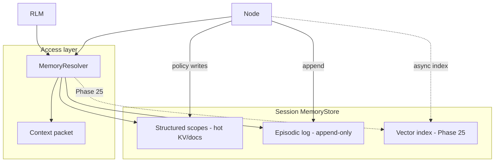

# Session Memory Architecture (Explore E)

**Date:** 2026-05-20  
**Context:** `$gsd-explore` — session-based memory for RLM and graph nodes, with optional vector retrieval, save/reopen, and user-controlled scope persistence.  
**Proposed phases:** 24 (store + resolver + save), 25 (vector search)

## Product intent

Runs need **continuity memory** that nodes and RLM sub-calls can access efficiently without re-ingesting full graph history or artifact payloads. Memory is **session-scoped by default**, **user-configurable per scope** for longer retention, and **saveable** so a workspace can be reopened, edited, and re-run.

## Relationship to existing design

| Existing piece | Role |
|----------------|------|
| `ComposerContextPolicy` (`reads`, `writes`, `limits`, `memoryScopes`) | Declares what each node may access; resolver enforces it |
| Hybrid artifact + state note (`.planning/notes/hybrid-artifact-state-architecture.md`) | Artifacts = deterministic edge handoffs; memory = continuity + retrieval |
| `MemoryManager` (RAM budgeting) | Unrelated — keep name; do not overload for semantic memory |
| Artifact refs on nodes | Memory stores refs + summaries + index chunks, not inlined blobs |

## Architecture: three layers, one store API



### Layer 1: Structured scopes (v1)

Named documents keyed by scope id (e.g. `speaker-bible`, `chapter-summary`, `run-manifest`).

- Small JSON or document paths with **path-level ACL** from `contextPolicy.writes` / `reads`.
- **Optimistic concurrency** (`version` / etag) on patch; rejected writes audited.
- **Lifetime** per scope (user chooses): `session` | `project` | `permanent`.

### Layer 2: Episodic log (v1)

Append-only record of run events: node id, timestamp, short summary, artifact refs, optional structured patch refs.

- Feeds **rolling summary** scopes (compressed periodically or on node completion).
- Cheap answer to “what happened in this run?” without vector search.

### Layer 3: Vector index (Phase 25 — deferred)

Embeddings of chunks from episodic entries, artifact excerpts, and user-pinned notes.

- **Lazy retrieval** only when policy includes `relevant memory entries`.
- Filtered by allowed `memoryScopes` + token budget from `contextPolicy.limits`.
- Indexed **async** after writes; not on critical path for v1 structured memory.

## MemoryResolver flow

**Before every `model.complete` (RLM sub-call or node execution):**

1. Resolve allowed scopes from node `contextPolicy.memoryScopes` + reads/writes.
2. Load structured scope documents (sync, versioned).
3. Load rolling summary from episodic layer if in policy.
4. *(Phase 25)* Vector top-k if policy requests relevant entries; respect char/token limits.
5. Pack **context packet** — bounded string block injected into messages (never full session dump).
6. Cache packet per task id until prompt changes.

**After completion:**

1. Apply structured writes to allowed paths (version check).
2. Append episodic entry (summary + refs, not full payloads).
3. *(Phase 25)* Queue async vector indexing for new text.

RLM recursion: subtasks inherit **session id**; depth/classify/decompose get **narrower** packets than top-level answer/synthesize.

## Scope lifetimes (user chooses)

| Lifetime | Behavior |
|----------|----------|
| `session` | Discarded when session closed unless saved in snapshot |
| `project` | Persists under project/workspace id; shared across sessions in same project |
| `permanent` | Long-lived store (e.g. speaker bibles, glossaries); survives project boundaries if user opts in |

UI: scope editor or per-scope dropdown when creating/pinning memory; sensible defaults per node type.

## Save & reopen (workspace restore — not true resume)

Saved session = **document snapshot**, not frozen in-process runtime.

**Snapshot includes:**

- Graph state (nodes, edges, positions, statuses, approvals)
- Full MemoryStore serialization (structured + episodic)
- Scope lifetime metadata
- Artifact refs (URIs/paths — not inlined file bytes)
- *(Phase 25)* Vector index files on disk

**On reopen (v1 semantics — option A):**

- User reviews/edits graph and memory
- Run again or **continue from last approval gate**
- **No** auto-resume mid-model-call, half-finished RLM tree, or in-flight quality loop

True execution resume (option B/C) is out of scope for v1.

## Efficiency rules

- **Reference, don’t embed** — artifacts on disk; memory holds refs + summaries + (later) embedding chunks.
- **Scope isolation** — nodes only read/write declared scopes.
- **Lazy vector retrieval** — only when policy asks; Phase 25.
- **Bounded packets** — enforce `contextPolicy.limits` (e.g. max chars for memory block).
- **Local storage** — SQLite or JSONL + files under `.rlm/sessions/` (exact layout TBD in plan-phase).

## Port sketch

```typescript
// src/ports/memory-store-port.ts (proposed)
interface MemoryStorePort {
  readScope(sessionId: string, scopeId: string): Promise<ScopeDocument>;
  patchScope(sessionId: string, scopeId: string, patch: ScopePatch, expectedVersion: number): Promise<ScopeDocument>;
  appendEpisodic(sessionId: string, entry: EpisodicEntry): Promise<void>;
  getRollingSummary(sessionId: string, scopeId: string): Promise<string>;
  snapshot(sessionId: string): Promise<MemorySnapshot>;
  restore(snapshot: MemorySnapshot): Promise<string>; // returns sessionId
}
```

`MemoryResolver` lives in application layer; wired from `runConfiguredAgent`, RLM engine, and UI execution runner.

## Phasing

| Phase | Deliverable |
|-------|-------------|
| **24** | `MemoryStorePort`, ACL + versioning, episodic log, `MemoryResolver`, save/reopen API + UI, wire to RLM/nodes |
| **25** | Vector adapter, async indexing, retrieval in resolver, basic inspector for retrieved chunks |

## Open spikes (before plan-phase)

- Snapshot file format (single JSON vs directory bundle).
- Project vs session id hierarchy for `project` lifetime scopes.
- Rolling summary compression strategy (model call vs heuristic truncate).
- Embedding model tier for Phase 25 (small local model).

## Success criteria (Phase 24)

- Node with `memoryScopes: ["speaker-bible"]` reads/writes scoped doc; unauthorized scope access rejected and audited.
- RLM sub-call receives bounded context packet derived from policy, not full graph.
- User saves session, closes app, reopens — graph + memory scopes restored; re-run from approval gate works.
- Session-only scope discarded on new session unless user sets longer lifetime.

## Success criteria (Phase 25)

- AI node with `relevant memory entries` in reads receives top-k chunks from vector index within token budget.
- Reopened saved session restores vector index; retrieval returns consistent results.
- New episodic content indexed async without blocking node completion.
