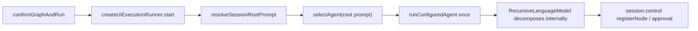
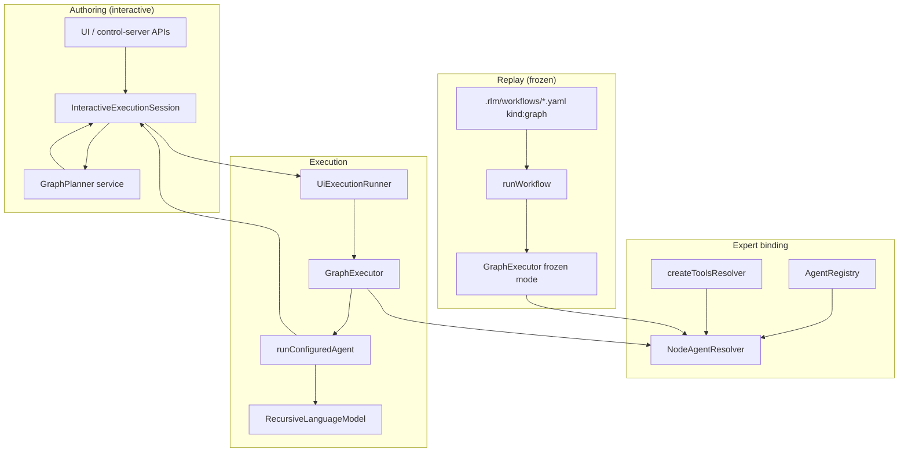

# Architecture Patterns: v1.5 Dynamic Graph Authoring

**Domain:** Local recursive LM CLI + interactive execution graph  
**Milestone:** v1.5 Dynamic Graph Authoring  
**Researched:** 2026-05-21  
**Overall confidence:** HIGH (grounded in live `src/` layout and v1.5 planning notes)

## Executive Summary

v1.5 adds three capabilities that today are **partially stubbed or split across the wrong owners**: model-driven **plan-from-node**, **frozen graph replay** (export/import), and **planner-assigned expert teams**. The existing stack already has strong foundations—`InteractiveExecutionSession` as the graph authority, `ExecutionControl` as the approval/event bridge into `RecursiveLanguageModel`, `runConfiguredAgent` + `PurposeRoutingLanguageModel` for execution, and `createAgentRegistry` / `createToolsResolver` for preset bundles. What is missing is intentional wiring: planning still uses keyword heuristics in `execution-controller.ts`, UI run still sends only the **root prompt** through `selectAgent` once, and `runWorkflow` only understands flat agent-list workflows.

The recommended shape keeps **one graph authority** (`InteractiveExecutionSession`), introduces a **GraphPlanner** application service and a **GraphExecutor** runner, and extends **workflow-runner** with a `kind: graph` branch—without duplicating approval, mutation, or session snapshot semantics.

---

## Current System (As-Is)

### Responsibility map

| Component | Owns today | Does not own today |
|-----------|------------|-------------------|
| `InteractiveExecutionSession` (`execution-controller.ts`) | Nodes/edges/layout, `planNode`, mutations, approvals, clarifications, session snapshot | Per-node LLM calls, expert resolution, walking planned topology at run time |
| `ExecutionControl` (`session.control`) | Callbacks RLM uses: `registerNode`, `updateNodeStatus`, `waitForNodeApproval` | Graph structure mutations (session methods only) |
| `RecursiveLanguageModel` | Internal task tree, dynamic spawn, mirrors nodes into session via `ExecutionControl` | Canvas-planned children as source of truth |
| `createUiExecutionRunner` | `beginConfirmedExecution` → single `runConfiguredAgent` on root prompt | Executing each planned child with its own expert/runtime |
| `runWorkflow` | Parallel agent-list dispatch, QA, validation commands | Topological graph execution, `kind: graph` |
| `createAgentRegistry` + `selectAgent` | Expert presets (profiles + config), keyword routing for CLI/UI root | Per-node `agentId` from graph nodes |
| `createToolsResolver` | Tool allowlists per `agents.*` config id | Per-node override allowlists at run time |

### Planning path today


`planNode` enforces budget via `findBudgetRoot` and `ComposerPlanBudget`, sets `pendingPlan` on the parent, and leaves children in `planned` status until approval—this behavior should be preserved. Only the **child spec producer** (`plannedChildrenFor`) gets replaced.

### Execution path today (UI)



Pre-planned canvas children are **not** executed as separate bound agents; RLM may add overlapping nodes dynamically. That is the main architectural gap for v1.5.

### Workflow path today

`runWorkflow` resolves `workflow.agents[]` (optional tier `dispatch`), runs agents in parallel, optionally QA—see `workflow-runner.ts`. Metadata `executionGraph` is a **flat slot list** (`workflow-agent-*`), not the interactive session topology.

---

## Target Architecture (v1.5)

### High-level diagram



### Design principles

1. **Session remains authoritative** for graph structure, protected-state flags, approvals, and export snapshots.
2. **Planner is a pure application service**—no graph mutations inside the planner; session applies diffs and emits events.
3. **Executor walks session topology** (parent/child edges), not RLM’s internal decomposition, for approved/frozen graphs.
4. **Expert binding is per-node** at execution time via `agentId` (+ optional overrides), with `selectAgent` reserved for non-graph CLI paths.
5. **No silent mode switches**—variant, runtime mode, and planner failures surface on CLI/UI consistently.

---

## Integration Points

### 1. `InteractiveExecutionSession` ↔ `GraphPlanner`

| Integration | Direction | Contract |
|-------------|-----------|----------|
| Plan submit | Session → Planner | Input: parent node, ancestor prompt chain, budget remainder, registry agent ids, project config tiers |
| Plan result | Planner → Session | Output: structured child specs (`label`, `prompt`, `composer.type`, `complexity`, `agentId`, `runtime`, optional tool/tier snapshots) |
| Apply plan | Session only | `registerNode` children, set `planGenerationId` / `plannedByParentId`, `originalPrompt`, status `planned` |
| Replan | Session orchestrates | Detect pristine vs protected; call planner with mode `replace` \| `merge`; merge passes pinned summaries |

**Replace in session:** `plannedChildrenFor()` call inside `planNode` (line ~345) becomes `await graphPlanner.planChildren(...)`.

**New session APIs (application layer on session or thin coordinator):**

- `replanNode(nodeId, options: { mode?: "replace" \| "merge" \| "cancel" })` — implements PLAN-04–06 from v1.3 requirements.
- `isSubtreePristine(parentId)` / `collectProtectedNodes(parentId)` — uses `originalPrompt !== prompt`, `modelOverrideSource === "user"`, `pinned`, manual `addNode` ids, future `assignmentMode === "custom"`.

**Default seed:** constructor should always seed `root-composer` (empty focused root), not only when `seedRootPrompt` is passed—aligns with graph-primary UX note.

### 2. `GraphPlanner` ↔ `agent-registry` + `project-config`

| Integration | Use |
|-------------|-----|
| `AgentRegistry.profiles` | Valid `agentId` set for planner output schema |
| `AgentConfig.models` | Purpose→tier hints in planner prompt; assigned snapshot on node for export |
| `agents.*.tools` | Default allowlist per expert; planner may narrow, not widen beyond config |
| `selectAgent` | **Not** used during graph planning; optional fallback only for legacy CLI single-prompt |

Planner should validate every emitted `agentId` with `findAgentOrThrow` before session applies nodes.

### 3. `GraphExecutor` ↔ `execution-controller` / `ExecutionControl`

| Integration | Use |
|-------------|-----|
| `session.snapshot().graph` | Source topology (roots → children via `parentId` + edges) |
| `session.control` | Pass through to every `runConfiguredAgent` call |
| `waitForNodeApproval` | Before each node run (or batch per approval mode); respect `planned` → approve flow |
| `updateNodeStatus` | Executor sets running/completed/failed; RLM also updates via control—executor owns top-level node lifecycle |
| `beginConfirmedExecution` / `finishConfirmedExecution` | Ui runner keeps these; executor runs inside the bracket |

**Execution modes:**

| Mode | Trigger | Behavior |
|------|---------|----------|
| Interactive run | UI confirm run | Walk approved/ready nodes in topological order; optional: still allow RLM spawn only when `composer.runtime === "rlm"` |
| Frozen replay | `runWorkflow` `kind: graph` | No planner calls; substitute `{{input}}` for pipeline variant; fail fast on missing agent/model/template |

**Critical:** For nodes with pre-authored children already on canvas, executor should pass **node-local prompt** and set RLM config so it does **not** re-decompose the same work (e.g. shallow `maxDepth` / explicit “execute this node only” flag—implementation detail for plan phase, but architecture must state the intent).

### 4. `NodeAgentResolver` ↔ `agent-registry` + `runtime-composition`

New module (recommended path: `src/application/node-agent-resolver.ts`):

```typescript
// Conceptual contract — not shipped API
resolveNodeAgent(input: {
  registry: AgentRegistry;
  toolsFor: (agentId: string) => ToolPort[];
  node: ExecutionGraphNode;
}): {
  agent: AgentProfile;
  tools: ToolPort[];
  agentSource: "planned" | "override" | "custom";
}
```

| Node field | Resolver behavior |
|------------|-------------------|
| `agentId` | `findAgentOrThrow(registry, agentId)` |
| `assignmentMode: "custom"` | Apply `node.toolAllowlist` / tier snapshot overrides on top of preset |
| `modelOverride` + `modelOverrideSource: "user"` | Passed into `runConfiguredAgent` / approval decision (existing) |
| `composer.runtime` | `"rlm"` → full `runConfiguredAgent`; `"single"` → single-pass completion path (new thin runner or RLM flag) |
| Missing `agentId` on old graphs | Explicit error at run start (EXPORT-07 / TEAM-07) |

Reuse `createToolsResolver` pattern: intersect configured agent tools with node allowlist when present.

### 5. `runConfiguredAgent` / `RecursiveLanguageModel` ↔ expert binding

| Field | Today | v1.5 |
|-------|-------|------|
| `input.agent` | One profile per run | One profile **per graph node** from resolver |
| `input.agentSource` | `"auto"` \| `"override"` | Extend metadata: `"planned"` \| `"custom"` |
| `constrainedToolCalling` | Agent tool list size | Enforce node allowlist (already supported when tools array is subset) |
| `metadata.agent` | Single id | Per-node trace should record expert + runtime mode |

`PurposeRoutingLanguageModel` unchanged—tiers come from `AgentConfig.models` on the resolved profile unless node carries tier snapshot overrides (export/custom).

### 6. `workflow-runner` ↔ graph workflows

Extend `WorkflowConfig` (or parallel sidecar metadata) with:

```yaml
workflows:
  feature-delivery:
    kind: graph
    path: .rlm/workflows/feature-delivery.yaml
```

| Branch | Behavior |
|--------|----------|
| `kind` absent / agent-list | Current `runWorkflow` unchanged |
| `kind: graph` | Load sidecar → build in-memory graph or hydrate session → `runGraphWorkflow` → `GraphExecutor` frozen mode |

`runGraphWorkflow` should share executor core with UI runner; differences: variant resolution (playbook/pipeline), no replan, CLI `--variant` override surfaced in metadata.

`combineWorkflowResults` pattern can aggregate per-node `RecursivePromptResult` into workflow answer sections keyed by node id/label.

### 7. `control-server` / UI

| API | Change |
|-----|--------|
| `POST .../plan` | Await planner; return planner errors explicitly |
| New `POST .../replan` | Body: `mode: replace \| merge \| cancel` |
| `POST /api/run` or confirm | Calls graph-aware runner |
| Expert fields | `POST .../expert`, `.../tools`, `.../runtime` mutation endpoints (or extend existing model/sampling routes) |

UI types in `ui/src` mirror extended `ExecutionGraphNode` fields for inspector parity.

### 8. Session memory (v1.4) ↔ graph nodes

No structural conflict: `contextPolicy` on `NodeComposer` already scopes memory reads. Executor should pass node `contextPolicy` into approval decisions and memory resolver inputs per run. Export sidecar must include `contextPolicy` + memory scope ids for replay fidelity.

---

## Type Extensions (`domain/types.ts`)

Add to `ExecutionGraphNode` (and export sidecar schema):

| Field | Purpose |
|-------|---------|
| `agentId?: string` | Planner-assigned expert preset |
| `assignmentMode?: "preset" \| "custom"` | Inspector override tracking |
| `toolAllowlist?: string[]` | Custom tool subset |
| `tierSnapshot?: Partial<Record<ModelPurpose, string>>` | Export/replay of purpose→tier |
| `runtimeMode?: "single" \| "rlm"` | Plan-time RLM escalation (distinct from composer `runtime` code/tts/model if both needed—plan phase may unify naming) |
| `planGenerationId?: string` | Replan pristine detection |
| `plannedByParentId?: string` | Lineage for protected merge |
| `pinned?: boolean` | User pin for merge semantics |

Extend `NodeComposer.runtime` or add parallel field if `code`/`tts` paths must coexist with `rlm`/`single` expert runtime—avoid overloading one enum.

Extend `WorkflowConfig` with optional `kind?: "graph"` and `path?: string`.

---

## New Components

| Component | Layer | Responsibility |
|-----------|-------|----------------|
| `GraphPlanner` | `src/application/graph-planner.ts` | Model-driven child planning + expert/runtime assignment |
| `GraphPlannerPort` | `src/ports/graph-planner-port.ts` | Interface + structured `PlannedChildSpec` types (testability) |
| `planning-context-builder.ts` | application | Ancestor prompts, budget, policy summaries for planner input |
| `subtree-protection.ts` | application | Pristine/protected detection, merge diff application |
| `NodeAgentResolver` | application | Node → `AgentProfile` + constrained tools |
| `GraphExecutor` | application | Topological execution over session or frozen graph |
| `graph-workflow-store.ts` | application | Load/save `.rlm/workflows/*.yaml`, variant merge, template substitution |
| `runGraphWorkflow` | application (or `workflow-runner` module) | CLI/UI entry for frozen graphs |

**Do not** fold planner logic into `RecursiveLanguageModel`—keeps domain recursion separate from human-authored graph planning.

---

## Build Order

Order respects dependencies from planning notes (B → export A → expert C) and minimizes rework on session/approval code.

### Wave 1 — Foundation (plan-from-node spine)

1. **Extend `ExecutionGraphNode` + sidecar types** — agent/runtime/plan lineage fields; Zod/schema in project-config if needed.
2. **`GraphPlannerPort` + `GraphPlanner`** — structured JSON plan output; validate agents; unit tests with fake model.
3. **Wire `planNode` to planner** — remove `plannedChildrenFor`; explicit failure states (PLAN-07).
4. **Default `root-composer` seed** — session constructor + UI empty canvas.
5. **Replan API + protection helpers** — pristine/protected/merge/replace/cancel on session (PLAN-04–06).

### Wave 2 — Expert binding (plan-time + run-time)

6. **`NodeAgentResolver`** — registry lookup, allowlist intersection, metadata source.
7. **Planner emits `agentId` + `runtimeMode`** — TEAM-01, TEAM-06; set on child nodes at plan time.
8. **Control-server + UI inspector** — expert/custom overrides (TEAM-02–03); overrides mark protected + `assignmentMode: custom`.
9. **Extend `runConfiguredAgent` metadata** — per-node agent source in trace.

### Wave 3 — Graph execution (close the loop)

10. **`GraphExecutor`** — topological walk, per-node resolver, `session.control` integration.
11. **Replace `createUiExecutionRunner` root-only path** — delegate to executor for multi-node graphs.
12. **Single-pass runtime path** — nodes with `runtimeMode: "single"` without full recursion (TEAM-07).
13. **Align RLM depth** — frozen/planned node execution does not duplicate decomposition (EXPORT-05).

### Wave 4 — Export/import + workflow CLI

14. **`graph-workflow-store`** — serialize/deserialize session snapshot subset; playbook/pipeline/both (EXPORT-01–03).
15. **`runWorkflow` graph branch** — `kind: graph`, variant smart default + `--variant` (EXPORT-06).
16. **Import → session** — round-trip edit (EXPORT-04); include expert fields (TEAM-08).
17. **CLI `index.ts`** — same entry points as UI; explicit errors for missing agents/templates (EXPORT-07).

### Wave 5 — Hardening

18. **Integration tests** — plan → approve → run multi-node; export → CLI run; protected replan dialogs.
19. **Session save/reopen** — ensure new fields persist through `session-memory-bridge` snapshots.

---

## Anti-Patterns to Avoid

### Dual graph truth without a driver mode

**What:** RLM keeps decomposing while canvas shows a different planned tree.  
**Instead:** Executor-driven mode for confirmed runs; RLM registers updates but does not invent sibling tasks outside graph edges.

### Planner inside `execution-controller.ts`

**What:** Thousand-line session class owns LLM prompts.  
**Instead:** Inject `GraphPlanner`; session applies structural diffs only.

### Reusing `selectAgent` for graph nodes

**What:** Keyword routing contradicts planner-assigned experts.  
**Instead:** `NodeAgentResolver` only; keep `selectAgent` for `--agent` CLI and non-graph workflows.

### Lossy export to agent-list workflows

**What:** Converting graph to `workflows.default` shape.  
**Instead:** `kind: graph` sidecars only (per graph-workflow-export note).

### Silent runtime escalation

**What:** Classify-at-run upgrades to RLM without UI.  
**Instead:** Planner sets `runtimeMode: rlm` at plan time; user may override explicitly (expert-team note).

---

## Scalability Considerations

| Concern | Interactive authoring | Frozen replay |
|---------|----------------------|---------------|
| Node count | Bounded by `ComposerPlanBudget` (existing) | Sidecar size; executor sequential/parallel policy per phase |
| Model calls | Sum of per-node budgets | Pre-declared in export metadata; fail if exceeds `maxModelCalls` |
| RAM | `MemoryManager` per `runConfiguredAgent` reservation (unchanged) | Same; graph run may queue nodes if memory pressure |
| Parallelism | v1 likely **sequential** topological for approvals clarity | Optional parallel only for independent branches in later milestone |

---

## Research Flags for Roadmap Phases

| Phase topic | Deeper research likely? | Reason |
|-------------|-------------------------|--------|
| Planner prompt/schema | Yes | JSON schema, retry, model tier for planning |
| Merge replan | Yes | Diff algorithm vs full replan of non-protected nodes |
| Single-pass runtime | Yes | New code path vs RLM `maxDepth: 0` |
| Graph executor parallelism | Later | Approval + clarification ordering |
| Per-node `literal \| template` beyond root | Later | EXPORT hybrid graphs |

---

## Sources

- `.planning/PROJECT.md` — v1.5 requirements and decisions
- `.planning/notes/node-centric-dynamic-planning.md` — plan-from-node, replan UX
- `.planning/notes/graph-workflow-export.md` — sidecar, variants, `runGraphWorkflow`
- `.planning/notes/expert-team-architecture.md` — expert presets, allowlists, runtime at plan time
- `src/application/execution-controller.ts` — `planNode`, `plannedChildrenFor`, session authority
- `src/application/workflow-runner.ts` — agent-list workflows
- `src/application/agent-registry.ts` — presets and `selectAgent`
- `src/application/ui-execution-runner.ts` — root-only execution gap
- `src/domain/recursive-language-model.ts` — `ExecutionControl` integration
- `.planning/milestones/v1.3-REQUIREMENTS.md` — PLAN/EXPORT/TEAM requirement IDs
