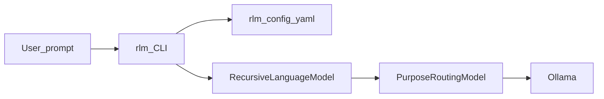

# Recursive Language Model (RLM)

A local **recursive prompting** CLI backed by **Ollama**. It breaks complex tasks into subtasks, runs them under explicit **budgets** (depth, branches, model calls, tool rounds), and routes **different models to different reasoning phases** so you can use smaller models for cheap steps and larger ones where it matters.

This is not a hosted product: it runs on your machine, reads [`rlm.config.yaml`](rlm.config.yaml) when present, and speaks HTTP to Ollama.

## Goals

- **Recursive workflows**: classify whether to recurse, decompose into bounded subtasks, solve children, optionally summarize, then synthesize an answer.
- **Right model for the right step**: each phase (`depth`, `classify`, `decompose`, `answer`, `summarize`, `synthesize`) maps to a **tier** (or `dynamic`) per agent; tiers resolve to concrete Ollama model names.
- **Multi-agent pipelines**: YAML **workflows** can run several agents (for example research, product design, coding) with optional **QA**, **validation commands**, and **bugfix queues** parsed from QA output.
- **Safety rails**: runtime limits from YAML `runtime` and CLI overrides (`--max-model-calls`, `--max-tool-rounds`, etc.).

## Non-goals

- No cloud orchestration or accounts; you bring Ollama and optional API keys for tools (for example web search).
- You are not forced into one global model: configuration chooses how monolithic or split the stack is.

## How it works



1. The CLI parses arguments and loads [`rlm.config.yaml`](rlm.config.yaml) from the current directory if `--config` is not set and the file exists; otherwise it uses built-in defaults from [`src/application/project-config.ts`](src/application/project-config.ts).
2. **Single-agent** mode: one agent profile is selected (auto-routed from the prompt or overridden with `--agent`).
3. **Workflow** mode (`--workflow <id>`): [`src/application/workflow-runner.ts`](src/application/workflow-runner.ts) runs the configured agent list (and optional QA) under RAM-aware dispatch.
4. [`RecursiveLanguageModel`](src/domain/recursive-language-model.ts) drives the recursive loop and passes a **purpose** into the model port for each completion.
5. [`PurposeRoutingLanguageModel`](src/application/model-provider.ts) picks the actual Ollama model name from the agent’s YAML `models` map and project `models.tiers`. Optional **rotation** can sample alternates and record scores (see `models.rotation` in YAML).

### Model call budget (important)

`--max-model-calls` / YAML `runtime.maxModelCalls` is enforced **inside each** `RecursiveLanguageModel` run. If you use a **workflow** with multiple agents (and optional QA), each agent run gets its own budget; combined `metadata.modelCalls` in the workflow result is the **sum** across agents, so total completions can exceed a single run’s limit.

## Prerequisites

- **Node.js** (see `package.json` engines if added later).
- **Ollama** installed and running, with the models referenced in `models.tiers` / `models.default` pulled locally.
- Optional: **`SERPAPI_API_KEY`** in the environment if any agent uses the `google_search` tool ([`src/adapters/serpapi-google-search-tool.ts`](src/adapters/serpapi-google-search-tool.ts)).

## Install and build

```bash
npm install
npm run build
```

The `rlm` binary is declared in `package.json` and points at `dist/src/index.js` after build. You can run it with `npx rlm` from the project root or link it globally as you prefer.

## Quick start

```bash
# Help (also: rlm help, rlm --help, rlm -h)
npx rlm help

# Single prompt, auto agent, default config discovery
npx rlm "Summarize how this repo structures agents and workflows"

# Fixed agent, JSON for scripting
npx rlm ask "List three risks for this design" --agent research --json

# Full workflow from rlm.config.yaml
npx rlm "Plan a small CLI feature" --workflow default --verbose
```

### Environment variables

| Variable | Effect |
|----------|--------|
| `OLLAMA_HOST` | Default Ollama base URL (overridable with `--base-url`). |
| `RLM_MODEL` | Same as `--model`: overrides the YAML default model (see `applyModelOverride` in [`project-config.ts`](src/application/project-config.ts)). |
| `RLM_VERBOSE` | `1` or `true` enables stderr progress logging (same idea as `--verbose`). |
| `SERPAPI_API_KEY` | Required for the `google_search` tool. |

## Configuration (`rlm.config.yaml`)

High-level sections (validated by [`src/application/project-config.ts`](src/application/project-config.ts)):

| Section | Purpose |
|---------|---------|
| `models.default` | Fallback model name string. |
| `models.tiers` | Named tiers (`small`, `medium`, …): each has `name` (Ollama tag), `estimatedRamMb`, optional `alternateModels` for rotation. |
| `models.rotation` | Optional A/B-style rotation: `enabled`, `sampleRate`, `scorePath`, optional `evaluatorTier`. |
| `agents.<id>.models` | Maps each **purpose** to a tier name or `dynamic` (tier scales with estimated recursion depth). |
| `agents.<id>.tools` | Tool ids wired in the CLI (`shell`, `write_file`, `google_search`, `web_fetch`). Unknown names fail at startup. |
| `workflows.<id>` | `mode: ram_queue`, `agents: [...]`, `continueOnError`, optional `qa` (agent + `validationCommands` + `bugfixQueue`), optional `dispatch` with `strategy: complexity_tiers` to vary agents by estimated prompt depth. |
| `memory` | RAM caps and waiting behavior for concurrent workflow agents. |
| `runtime` | Defaults for `maxDynamicDepth`, `maxBranches`, `maxPromptCharacters`, `maxModelCalls`, `maxToolRounds`, optional `maxDepth`. |

CLI flags such as `--max-depth`, `--max-model-calls`, and `--branches` **override** the merged YAML runtime for that invocation (see [`src/cli/args.ts`](src/cli/args.ts) and `resolveRuntimeConfig`).

## CLI reference

Options are also printed by `npx rlm help` (from [`helpText()`](src/cli/args.ts)):

- `--depth <n>` — Fixed recursion depth override (disables model-selected depth for that run).
- `--max-depth <n>` — Cap on model-selected depth.
- `--branches <n>` — Max subtasks per decomposition step.
- `--max-prompt-chars <n>` — Truncate task prompts.
- `--max-model-calls <n>` — Model completion budget **per agent engine run** (see note above for workflows).
- `--max-tool-rounds <n>` — Tool call rounds allowed within one model step when tools are enabled.
- `--model <name>` — Override YAML default Ollama model.
- `--agent <id>` — Force an agent (`default`, `coding`, `product_designer`, `research`, `qa`, … as defined in YAML).
- `--workflow <id>` — Run a configured workflow.
- `--config <path>` — YAML path; default discovery is `./rlm.config.yaml` when readable.
- `--base-url <url>` — Ollama base URL.
- `--json` — Stable JSON on stdout (errors on stderr as JSON when possible).
- `--compact` — Single-line oriented summary.
- `--trace` — Include recursion trace in output.
- `--verbose` — Structured logs to stderr.

## Output

[`src/cli/render.ts`](src/cli/render.ts) formats the result: default human-readable answer, optional trace, `--compact` lines, or `--json` including metadata such as `modelCalls`, `tokenUsage`, `toolCalls`, and workflow fields when applicable.

## Development

```bash
npm run typecheck
npm test
```

Tests under [`tests/`](tests/) cover argument parsing, the recursive engine, and workflow behavior; they are a good reference for expected YAML shapes and CLI flags.

## Contributing / architecture

See [`AGENTS.md`](AGENTS.md) for a concise map of directories and extension points.
